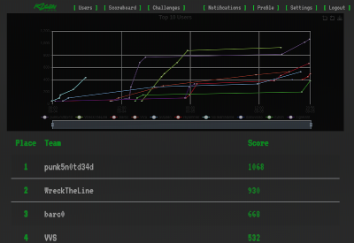

One good thing in Covid-19 lockdowns (yes, good!) was switching a lot of conferences/CTFs to virtual/hybrid mode which gave me possibility to visit them and even participate in some fun CTFS.

One of them was CTF at r2con (radare2 conference):

<!--more-->

I like all reverse engineering stuff and radare2 software is not the exception.

I got 4th place and got first blood on AEStethic task solving it in unexpected (as usually %) way.

As usually - my [writeups](https://github.com/BlackVS/CTFs/tree/master/r2con2020).

