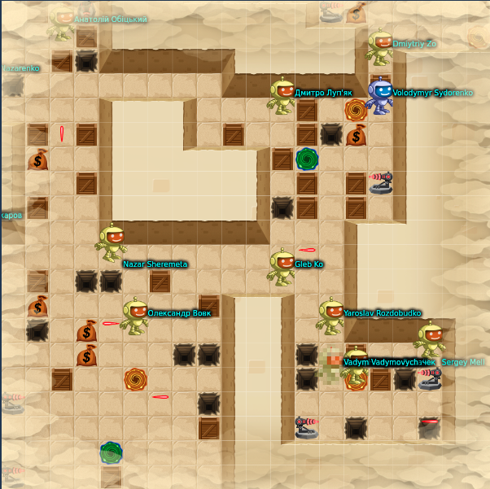

One more bot challenge at the end of 2020.

This time it was ... Zombie.

<!--more-->

This time I was prepared much better due to already had expirience of such challenge this summer.

I wrote much more complicated bot code comparing to the summer's one, this time it was based on A* but modificated by me to support negative weights also. I named it [Q*](https://github.com/BlackVS/botchallenge-epam-2020-Zombie/blob/main/current/qstar.py) $)

And I was 2nd!!! (thanks to EPAM for cool prize!!!)

My bot source code is [here](https://github.com/BlackVS/Bots/tree/main/EPAM/2020/Zombie)

My "control center":

