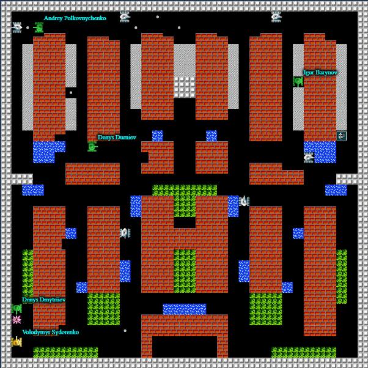

It was the first EPAM's bot challenge in the 2021, this time dediceted to the wellknown old game - Tanks %)

<!--more-->

This time I had not enough time to participate but I finally made some stuff I didn't before: full game recording and replay (recording input data and game states) which will help me in the next bot chellenge (I hope this one wasn't the last? %)

Code and description to it can be found [here](https://github.com/BlackVS/tanki).

Control center:

And some funny video:

<iframe width="1077" height="606" src="https://www.youtube.com/embed/6FoVoaILWBs" title="YouTube video player" frameborder="0" allow="accelerometer; autoplay; clipboard-write; encrypted-media; gyroscope; picture-in-picture" allowfullscreen></iframe>

