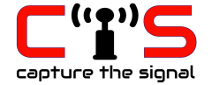
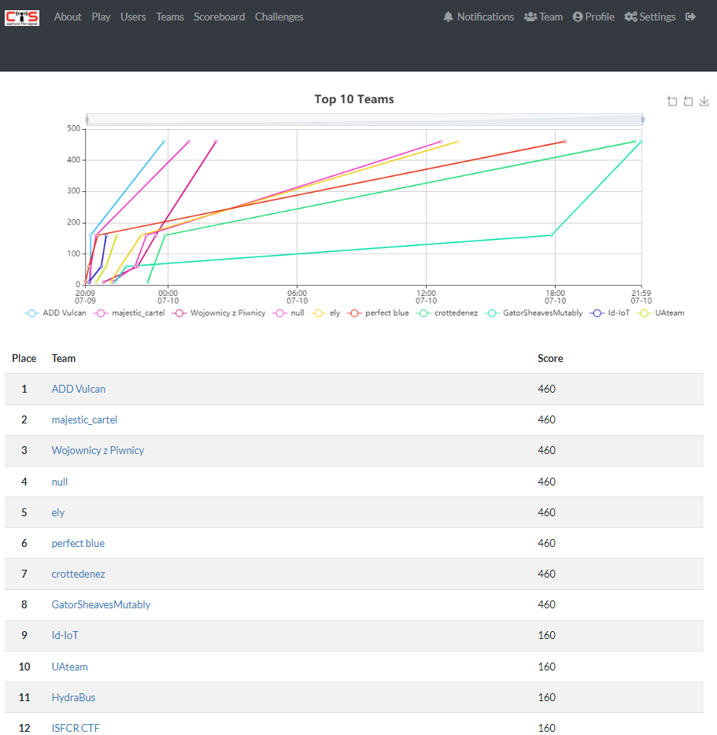

One more funny CTF - this time software radio related %)

<!--more-->

As mentioned on official [CTS site](https://cts.ninja/):

```
Capture the Signal (CTS) is a new challenge-based CTF that focuses exclusively on the reverse engineering of radio signals. This activity is also known as “blind signal analysis” as the signals' specification are unknown to the attacker.

In normal circumstances, the game is hosted on site at conferences world-wide, where our radio signals are distributed “over IP”. The use of IP eliminates the complexity of deploying actual radios and transmitting RF over the air.

Each radio signal corresponds to a challenge. The challenges are sorted by difficulty, and each solved challenge gives you access to the next one. In other words, the flag contained in each signal represents the clue to the next radio signal. The more points are scored, the closer the contestant is to win.

Participants are also welcome to use Software Defined Radio (SDR) equipment to interact directly with RF signals over the air.

This contest is organized by renowned community radio-hackers for researchers, hackers, and practitioners in the field!
```

Thanks to... khmmm, khe-khe... lockdowns - this time this CTF was fully remote.

Radio signals were "sent" via TCP using [cts-tools](https://github.com/capturethesignal/cts-tools) toolkit.

I tried to attend the same CTS one year ago but stuck on these tools setup %))

This time I started to prepare earlier. Even more - I migrated official tools to latest Python/GNU radio - [link](https://github.com/BlackVS/cts-tools/). Plus created some additional [scripts/tools](https://github.com/BlackVS/cts-utils) to simplify some stuff.


I got 10th place:

. 

Not bad for the first time.

As usually - my [writeups](https://github.com/BlackVS/CTFs/tree/master/HWIO2021/CTS).
