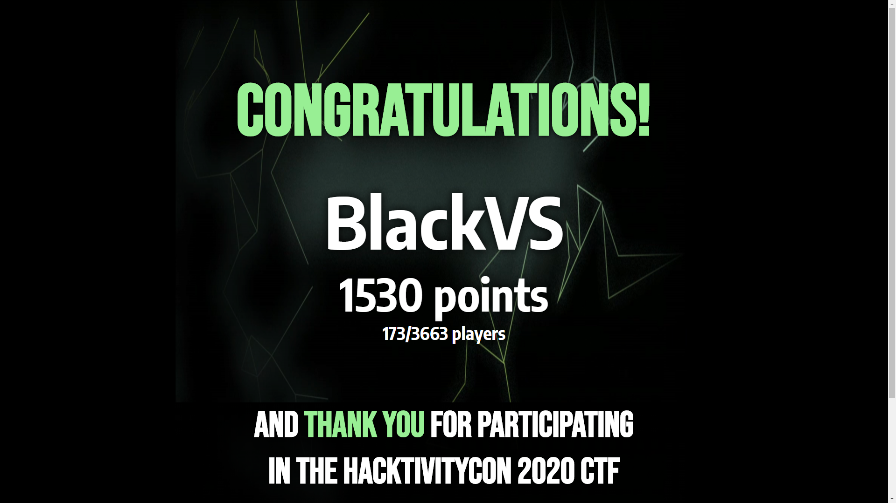
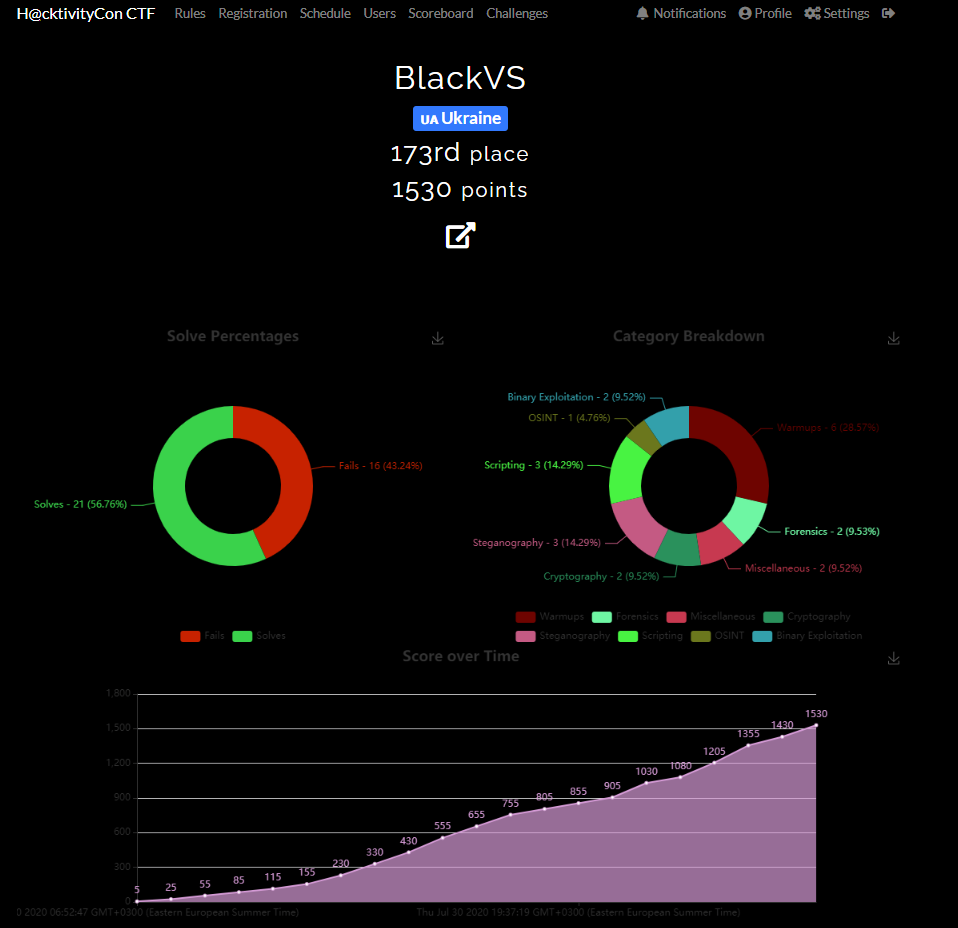

One more virtual/hybrid conference with CTF - HackerOne hosted [Hackivity Con 2020](https://www.hackerone.com/hacktivitycon)

<!--more-->

It is usual Jeopardy style CTF with a lot of [tasks](https://github.com/oxy-gendotmobi/ctf.hacktivitycon.2020.writeup.reference).

I got 173th place from 3663.

 

 

