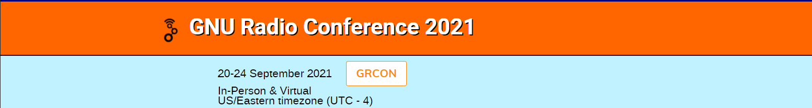
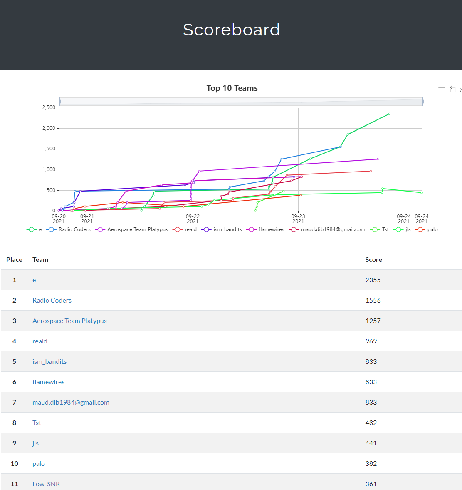

Again CTS CTF - this time on GNU Radio 2021 conference (virtual) %)

<!--more-->

[Rules](../images/GRUCON2021/main.png) as the same as before at HWIO2021 but this time signals are given as download links (i.e. no need to use CTS tools): Also some tasks were software programming related - its is plus for me due to my previous competitive programming expirience %)

This time I was prepared much better and our team got... the 2nd place %):

As usually - my [writeups](https://github.com/BlackVS/CTFs/tree/master/GRUCon2021).
