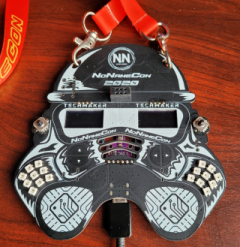

## NoNameBadge 2020 CTF

Next year I started to prepare to CTF much yearlier - as only details of upcoming CTF had become known %)

First of all I wrote my own ESP dissection software, later named [ESP32knife](https://github.com/BlackVS/esp32knife). 

Also I analyzed a set of compiled with ESP-IDF projects to extract symbol/function's signatures.

This saved me a lot of time and allowed...

take first place, getting first blood in all tasks %))

As usually I did all task by harder way then expected - just compare my and athour's writeups:

- CTF NNC2020, walkthrough by Anvol, [video](https://www.youtube.com/watch?v=THuKw9CntR0&feature=youtu.be), [slides](https://gitlab.com/coders-in-ua/nonamebadge-2020-ctf/-/raw/master/docs/CTFwalkthroughByAnVol.pdf?inline=false)
- [Write-ups by VVS](https://gitlab.com/coders-in-ua/nonamebadge-2020-ctf)

Also I created [ESP32 reversing](https://github.com/BlackVS/ESP32-reversing) repository to keep all found ESP32 reversing related stuff.

Thanks for prizes (especially red badge %):

and looking forward for the NNC 2021 CTF %)

