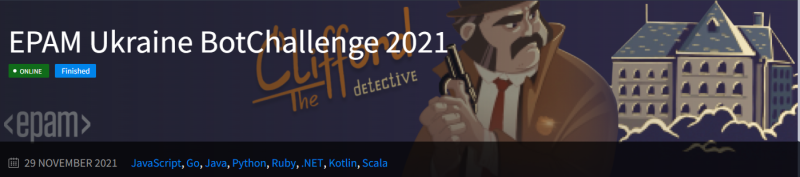

The last big 2 weeks bot challenge at the end of 2021: [Clifford](https://dojorena.io/events/355)

<!--more-->

I took 9th place and got fun prize (Smart Thermos):

My Control Center:

and bot [sources](https://github.com/BlackVS/Bots/tree/main/EPAM/2021/Clifford/)

It partially based on Zombie ( https://github.com/BlackVS/Bots/tree/main/EPAM/2020/Zombie ) but a lot of changed done. Main goal to participate in bot challenge was try new approaches %) and this goal is 100% reached.